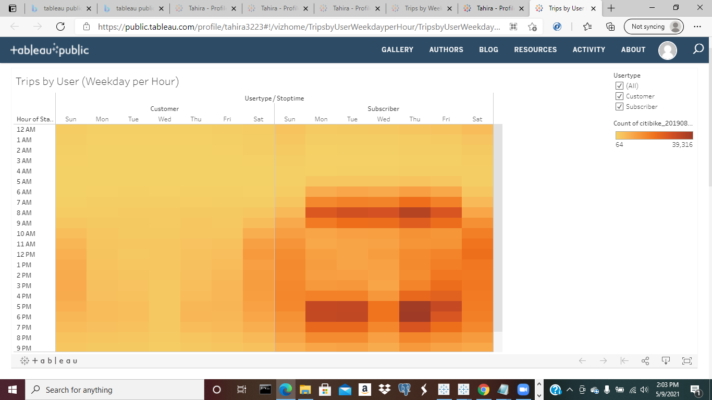

## Bikesharing

OVERVIEW

Purpose of This Analysis

The purpose of this analysis is to convince investors that a bike-sharing program in Des Moines is a solid business proposal. Completing a bike trip analysis with visual images,
a shared story, and a description will solidify this proposal.

RESULTS

Results of this Analysis

The first visualization provides the length of time that bikes are checked out for all riders. 

[link to dashboard](https://public.tableau.com/profile/tahira3223#!/vizhome/NumberofRides_16203860702710/NumberofRides) "Number of Rides"

Open the file containing Number_of_Rides.

Close the file.

The second visualization provides the length of time that bikes are checked out for each Gender. 0=Female, 1=Male, 2="Unknown". As shown in the image, Males check out bikes for a longer amount of time, in comparison to their female, and unknown counterparts. 

[link to dashboard](https://public.tableau.com/profile/tahira3223#!/vizhome/CheckoutTimesbyGender_16203866093390/CheckoutTimesbyGender) "Checkout Times by Gender"

Open the file containing Checkout_Times_by_Gender.

Close the file.

The third visualization provides the number of bike trips by weekday for each hour of the day. As shown in the image, the heatmap shows that a popular time to take bike trips are between the hours of 5pm and 8pm during the weekday.

[link to dashboard](https://public.tableau.com/profile/tahira3223#!/vizhome/TripsbyWeekdayperHour_16203867193230/TripsbyWeekdayperHour?publish=yes) "Trips by Weekday per Hour"

Open the file containing Trips_by_Weekday_per_Hour.

Close the file.
	
The fourth visualization provides the number of bike trips by gender for each hour of the week. As shown in the image, males has a higher amount of bike trips for each hour of the week. Females has the second highest amount of bike trips each week. Unknown genders have a low amount of bike trips each week. 

[link to dashboard](https://public.tableau.com/profile/tahira3223#!/vizhome/TripsbyGenderWeekdayperHour_16203868434960/TripsbyGenderWeekdayperHour?publish=yes) "Trips by Gender"

Open the file containing Trips_by_Gender.

Close the file.

The fifth visualization provides the number of bike trips by gender for each hour for each day of the week. As shown in the image, female customers have a lower rate of bike trips each hour for each day of the week, in comparison to its subscriber counterparts with a higher rate of bike trips.Male customers have a lower rate of bike trips each hour for each day of the week, in comparison to its subscriber counterparts with a higher rate of bike trips. Unknown customers have a higher rate of bike trips each hour for each day of the week, in comparison to its subscriber counterparts with a lower rate of bike trips. 

[link to dashboard](https://public.tableau.com/profile/tahira3223#!/vizhome/UserTripsbyGenderbyWeekday_16204421135930/UserTripsbyGenderbyWeekday?publish=yes)

Open the file containing User_Trips_by_Gender_by_Weekday.

 "User Trips by Gender by Weekday"

Close the file.

The sixth visualization provides a geographical mapping location of the start station latitude and start station longitude of the bike rental starting points. As shown in the
image, there is a geographical map of the bike rental starting points in Des Moines. 

[link to dashboard](https://public.tableau.com/profile/tahira3223#!/vizhome/TopStartingLocation/TopStartingLocation) "Top Starting Location"

Open the file containing Top_Starting_Location.

Close the file.
	
The seventh visualization provides a geographical mapping location of the ending station latitude and ending station longitude of the bike rental starting points. As shown in the image, there is a geographical map of the bike rental ending points in Des Moines. 

[link to dashboard](https://public.tableau.com/profile/tahira3223#!/vizhome/TopEndingLocation/TopEndingLocation) "Top Ending Location"

Open the file containing Top_Ending_Location.

Close the file.
	
SUMMARY

Results and Two Additional Visualizations

The results of this analysis provides visualization data that the bike-sharing program have a higher rate of males than females and unknown genders. Also, male and female subcribers have a higher rate of bike trips each hour for each day of the week, in comparison to its unknown subscribers. In addition, unknown customers have a higher rate of bike trips each hour for each day of the week, in comparison to its male and female customer counterparts with a lower rate of bike trips. 

Two additional visualizations suggested for future analysis is "Trips by Users (Weekday per Hour)" and "Trips by Users (Hours per Month)".

The first additional visualization provides the number of bike trips by customers and subscribers for each hour for each day of the week. As shown in the image, customers have a lower rate of bike trips each hour for each day of the week, in comparison to its subscriber counterparts with a higher rate of bike trips. 

[link to dashboard](https://public.tableau.com/profile/tahira3223#!/vizhome/TripsbyUserWeekdayperHour/TripsbyUserWeekdayperHour?publish=yes) "Trips by Users (Weekday per Hour)"

Open the file containing Weekday_per_Hour.

Close the file.

The second additional visualization provides the number of bike trips by customers and subscribers for each hour for each month. As shown in the image, customers have a lower rate of bike trips each hour for each month, in comparison to its subscriber counterparts with a higher rate of bike trips. 

[link to dashboard](https://public.tableau.com/profile/tahira3223#!/vizhome/TripsbyUsersHoursperMonth_16205163492110/TripsbyUsersHoursperMonth)

Open the file containing Trips_by_Users_Hours_per_Month.

 "Trips by Users (Hours per Month)"

Close the file.
	
The ten visualizations in this analysis has data of customers and subcribers expected time of using a bike-sharing program, and when bikes are not used. This data provides the company with an effective time to pick up the bikes that needs to be picked up or fixed. The data and visualizations shared in this analysis confirms that a bike-sharing program in Des Moines is a solid business proposal. 
